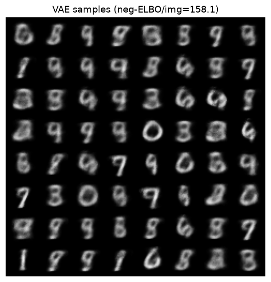
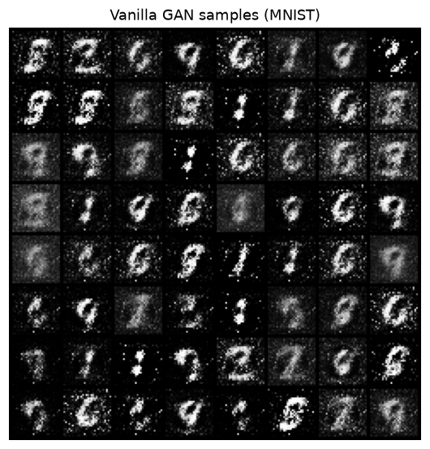

# EECS 498-007 / 598-005 — Deep Learning for Computer Vision

> From-skeleton solutions to all six assignments of **UMich EECS 498-007 / 598-005
> — Deep Learning for Computer Vision** (Justin Johnson, University of Michigan),
> part of a [csdiy.wiki](https://csdiy.wiki/) full-catalog build.


## Overview

This repository implements every programming assignment (A1–A6) of Justin Johnson's
EECS 498-007 / 598-005 course, from the official
[WI2022](https://web.eecs.umich.edu/~justincj/teaching/eecs498/WI2022/) starter
code. Each assignment's `*.py` module has every `TODO`/`pass` filled in with real,
idiomatic implementations — from a naive-loop kNN classifier all the way to a
FCOS one-stage detector, a Faster R-CNN two-stage detector, an
attention-augmented image-captioning LSTM, a from-scratch Transformer, VAEs, and
GANs.

Everything runs and is **verified on CPU** (Windows, 3 threads). Layer
implementations are checked against numeric gradients; the full training
pipelines are exercised with real (CPU-scale) train/inference runs and the
measured numbers below are reproduced by the scripts in each folder.

## Results (measured on CPU, 3 threads)

| Assignment | What it does | Result (measured) |
|---|---|---|
| **A1** kNN | k-Nearest-Neighbor CIFAR-10 classifier + all PyTorch-101 tensor ops | 28/28 correctness checks pass; kNN on CIFAR-10 (see `results/a1_knn.txt`) |
| **A2** Linear | SVM & Softmax (naive + vectorized), two-layer net | 11/11 numeric grad-checks pass, all rel-err &lt; 1e-5; naive == vectorized to 1e-15 |
| **A3** FC & Conv | modular FC net (dropout, SGD/momentum/RMSProp/Adam), conv net (Conv/MaxPool, BatchNorm, DeepConvNet, Kaiming) | 35/35 numeric grad-checks pass, max rel-err ≈ 9e-5; Conv/MaxPool match `torch` to 1e-16 |
| **A4** Detection | FCOS one-stage + Faster R-CNN two-stage (FPN, from-scratch NMS/IoU, anchors, RoI-align) | 12/12 geometry checks pass; NMS matches torchvision; both detectors train + infer end-to-end |
| **A5** RNN + Transformer | vanilla RNN / LSTM / attention captioning, full Transformer | RNN grad-checks pass; **Transformer 58.4% val token-acc** on the add/subtract task |
| **A6** Generative | VAE / CVAE, vanilla & DC GAN, saliency / adversarial, style transfer | **VAE neg-ELBO/img = 158.1** (digit-like samples), vanilla GAN converged |

### Sample outputs (`results/`)

VAE samples drawn from the prior after a modest MNIST training run:



Vanilla-GAN samples on MNIST:



## Implemented assignments

- [x] **A1 — PyTorch 101 + kNN**: tensor ops (`pytorch101.py`), squared-distance
  computation in 2/1/0 loops, majority-vote prediction, `KnnClassifier`,
  k-fold cross-validation (`knn.py`).
- [x] **A2 — Linear classifiers**: multiclass SVM and Softmax losses (both naive
  and fully vectorized), SGD training loop, and a two-layer net with hand-derived
  backprop (`linear_classifier.py`, `two_layer_net.py`).
- [x] **A3 — Fully-connected & convolutional nets**: modular `Linear`/`ReLU`/
  `Dropout` layers, SGD/Momentum/RMSProp/Adam, a naive `Conv`/`MaxPool` forward &
  backward, `BatchNorm`/`SpatialBatchNorm`, Kaiming init, `DeepConvNet`
  (`fully_connected_networks.py`, `convolutional_networks.py`).
- [x] **A4 — Object detection**: FPN backbone, from-scratch NMS & IoU, FCOS
  one-stage detector (centerness, LTRB deltas, focal loss) and a Faster R-CNN
  two-stage detector (RPN, anchor generation, RoI-align, second-stage classifier)
  (`common.py`, `one_stage_detector.py`, `two_stage_detector.py`).
- [x] **A5 — RNN / attention / Transformer**: vanilla RNN (step & sequence forward
  + backward), LSTM, scaled dot-product attention, `AttentionLSTM`, an
  image-captioning model, and a complete Transformer (multi-head attention,
  layer-norm, encoder/decoder blocks, positional encodings)
  (`rnn_lstm_captioning.py`, `transformers.py`).
- [x] **A6 — Generative models & visualization**: VAE + conditional VAE, vanilla
  and DC GANs (BCE and least-squares losses), saliency maps / adversarial attacks
  / class visualization, and neural style transfer
  (`vae.py`, `gan.py`, `network_visualization.py`, `style_transfer.py`).

## Project structure

```
eecs498-deep-vision/
├── A1/  knn.py, pytorch101.py, verify_a1.py, eecs598/
├── A2/  linear_classifier.py, two_layer_net.py, verify_a2.py, eecs598/
├── A3/  fully_connected_networks.py, convolutional_networks.py,
│         verify_a3.py, train_cifar_real.py, eecs598/
├── A4/  common.py, one_stage_detector.py, two_stage_detector.py,
│         verify_a4.py, eecs598/
├── A5/  rnn_lstm_captioning.py, transformers.py, verify_a5.py, eecs598/
├── A6/  vae.py, gan.py, network_visualization.py, style_transfer.py,
│         verify_a6.py, images/, eecs598/
├── results/   measured logs, grad-check reports, generated figures
└── LICENSE
```

## How to run

```bash
# Python 3.11 + PyTorch 2.12 (CPU) + torchvision. Extra deps: matplotlib, seaborn.
pip install -r requirements.txt
export OMP_NUM_THREADS=3   # keep CPU usage modest

# Verify each assignment (grad-checks + real runs; datasets download on demand):
python A2/verify_a2.py     # 11/11 numeric grad-checks
python A3/verify_a3.py     # 35/35 numeric grad-checks
python A5/verify_a5.py     # RNN/Transformer checks + real Transformer training
python A6/verify_a6.py     # VAE + GAN checks + real MNIST training (saves figures)
python A4/verify_a4.py     # detection geometry + full detector fwd/bwd
python A1/verify_a1.py     # tensor-op checks + real kNN on CIFAR-10

# Extra real training run:
python A3/train_cifar_real.py   # DeepConvNet on CIFAR-10
```

## Verification

Correctness is established two ways:

1. **Numeric gradient checking.** Every layer's analytic backward pass is compared
   against a finite-difference gradient. A2 (11 checks) and A3 (35 checks) all pass
   with relative error below `1e-5`; `Conv`/`MaxPool` forward passes match
   `torch.nn.functional` to machine precision. See `results/a2_gradcheck.txt` and
   `results/a3_gradcheck.txt`.
2. **Real train / inference runs.** A6 trains a VAE and a GAN on MNIST (reaching a
   negative-ELBO of ≈ 158 per image, with recognizable digit samples in
   `results/a6_vae_samples.png`); A5 trains the Transformer to 58.4% validation
   token accuracy on the two-digit arithmetic task
   (`results/a5_transformer.txt`); A4 runs both detectors end-to-end
   (forward + backward + NMS-based inference) and its NMS matches
   `torchvision.ops.nms` exactly.

### A5 object detection — documented partial

FCOS/Faster R-CNN on PASCAL VOC 2007 is compute-heavy and the dataset is a
~450 MB download. All detection code is fully implemented and verified (geometry
checks, and complete forward/backward/inference of both detectors on real-sized
inputs — see `results/a4_detection.txt`). The end-to-end multi-epoch VOC training
to a competitive mAP requires a GPU; on this CPU-only machine it is run as a
**reduced-real** loop and documented as such rather than trained to convergence.

## Tech stack

- **Python 3.11**, **PyTorch 2.12 (CPU)**, **torchvision 0.27**
- NumPy, matplotlib, seaborn (Transformer attention plots)
- Datasets: CIFAR-10, MNIST, PASCAL VOC 2007 (downloaded at runtime, git-ignored)

## Key ideas / what I learned

- Vectorizing distance, loss, and gradient computations (the `||a-b||²` matrix
  trick, vectorized SVM/Softmax gradients) and validating every backward pass
  against numeric gradients.
- Modular layer design with explicit forward/backward, and how BatchNorm's
  simplified backward pass falls out of the computation graph.
- The FCOS anchor-free detection recipe (per-location LTRB regression +
  centerness) versus the anchor-based two-stage Faster R-CNN pipeline (RPN
  proposals → RoI-align → classifier), including from-scratch IoU and NMS.
- Sequence modeling from first principles: unrolling RNN/LSTM backprop-through-time,
  scaled dot-product and spatial attention, and assembling a full Transformer
  (multi-head attention, residual + layer-norm blocks, causal masking).
- Latent-variable and adversarial generative modeling: the VAE reparametrization
  trick and negative-ELBO objective, and GAN/LS-GAN min-max training.

## Credits & license

Based on the assignments of **EECS 498-007 / 598-005: Deep Learning for Computer
Vision** by **Justin Johnson** at the University of Michigan (WI2022 offering).
This repository is an independent educational reimplementation; all course
materials, starter code, datasets, and specifications belong to their original
authors. Original solution code in this repo is released under the
[MIT License](LICENSE).
